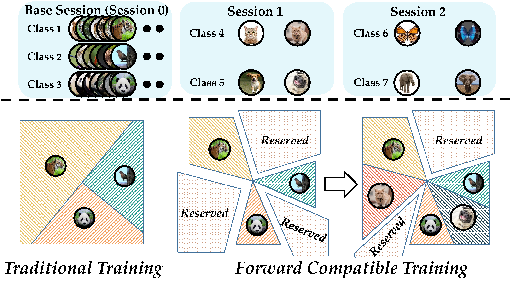
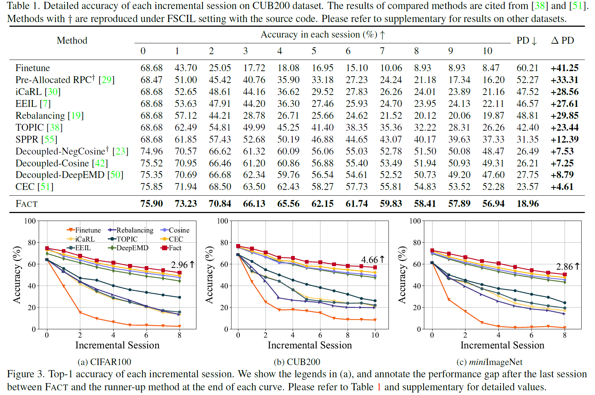

# Forward Compatible Few-Shot Class-Incremental Learning  (FACT)

The code repository for "Forward Compatible Few-Shot Class-Incremental Learning
" [[paper]](https://arxiv.org/abs/2203.06953) (CVPR22) in PyTorch. If you use any content of this repo for your work, please cite the following bib entry:

    @inproceedings{zhou2022forward,
    title={Forward Compatible Few-Shot Class-Incremental Learning},
    author={Zhou, Da-Wei and Wang, Fu-Yun and Ye, Han-Jia and Ma, Liang and Pu, Shiliang and Zhan, De-Chuan},
    booktitle={CVPR},
    year={2022}
    }

## Forward Compatible Few-Shot Class-Incremental Learning


Novel classes frequently arise in our dynamically changing world, e.g., new users in the authentication system, and a machine learning model should recognize new classes without forgetting old ones. This scenario becomes more challenging when new class instances are insufficient, which is called few-shot class-incremental learning (FSCIL). Current methods handle incremental learning retrospectively by making the updated model similar to the old one. By contrast, we suggest learning prospectively to prepare for future updates, and propose ForwArd Compatible Training (FACT) for FSCIL. Forward compatibility requires future new classes to be easily incorporated into the current model based on the current stage data, and we seek to realize it by reserving embedding space for future new classes. In detail, we assign virtual prototypes to squeeze the embedding of known classes and reserve for new ones. Besides, we forecast possible new classes and prepare for the updating process. The virtual prototypes allow the model to accept possible updates in the future, which act as proxies scattered among embedding space to build a stronger classifier during inference. FACT efficiently incorporates new classes with forward compatibility and meanwhile resists forgetting of old ones. Extensive experiments on benchmark and large scale datasets validate FACT's state-of-the-art performance.



## Results


Please refer to our [paper](https://arxiv.org/abs/2203.06953) for detailed values.

## Prerequisites

The following packages are required to run the scripts:

- [PyTorch-1.4 and torchvision](https://pytorch.org)

- tqdm

## Dataset
We provide the source code on three benchmark datasets, i.e., CIFAR100, CUB200 and miniImageNet. Please follow the guidelines in [CEC](https://github.com/icoz69/CEC-CVPR2021) to prepare them.

The split of ImageNet100/1000 is availabel at [Google Drive](https://drive.google.com/drive/folders/1IBjVEmwmLBdABTaD6cDbrdHMXfHHtFvU?usp=sharing).

## Code Structures
There are four parts in the code.
 - `models`: It contains the backbone network and training protocols for the experiment.
 - `data`: Images and splits for the data sets.
- `dataloader`: Dataloader of different datasets.
 - `checkpoint`: The weights and logs of the experiment.
 
## Training scripts

- Train CIFAR100

  ```
  python train.py -projec fact -dataset cifar100  -base_mode "ft_cos" -new_mode "avg_cos" -gamma 0.1 -lr_base 0.1 -lr_new 0.1 -decay 0.0005 -epochs_base 600 -schedule Cosine -gpu 0,1,2,3 -temperature 16 -batch_size_base 256   -balance 0.001 -loss_iter 0 -alpha 0.5 >>CIFAR-FACT.txt
  ```
  
- Train CUB200
    ```
    python train.py -project fact -dataset cub200 -base_mode 'ft_cos' -new_mode 'avg_cos' -gamma 0.25 -lr_base 0.005 -lr_new 0.1 -decay 0.0005 -epochs_base 400 -schedule Milestone -milestones 50 100 150 200 250 300 -gpu '3,2,1,0' -temperature 16 -dataroot YOURDATAROOT -batch_size_base 256 -balance 0.01 -loss_iter 0  >>CUB-FACT.txt 
    ```

- Train miniImageNet
    ```
    python train.py -project fact -dataset mini_imagenet -base_mode 'ft_cos' -new_mode 'avg_cos' -gamma 0.1 -lr_base 0.1 -lr_new 0.1 -decay 0.0005 -epochs_base 1000 -schedule Cosine  -gpu 1,2,3,0 -temperature 16 -dataroot YOURDATAROOT -alpha 0.5 -balance 0.01 -loss_iter 150 -eta 0.1 >>MINI-FACT.txt  
    ```

Remember to change `YOURDATAROOT` into your own data root, or you will encounter errors.

  

 
## Acknowledgment
We thank the following repos providing helpful components/functions in our work.

- [Awesome Few-Shot Class-Incremental Learning](https://github.com/zhoudw-zdw/Awesome-Few-Shot-Class-Incremental-Learning)

- [PyCIL: A Python Toolbox for Class-Incremental Learning](https://github.com/G-U-N/PyCIL)

- [Proser](https://github.com/zhoudw-zdw/CVPR21-Proser)

- [CEC](https://github.com/icoz69/CEC-CVPR2021)


## Contact 
If there are any questions, please feel free to contact with the author:  Da-Wei Zhou (zhoudw@lamda.nju.edu.cn). Enjoy the code.
